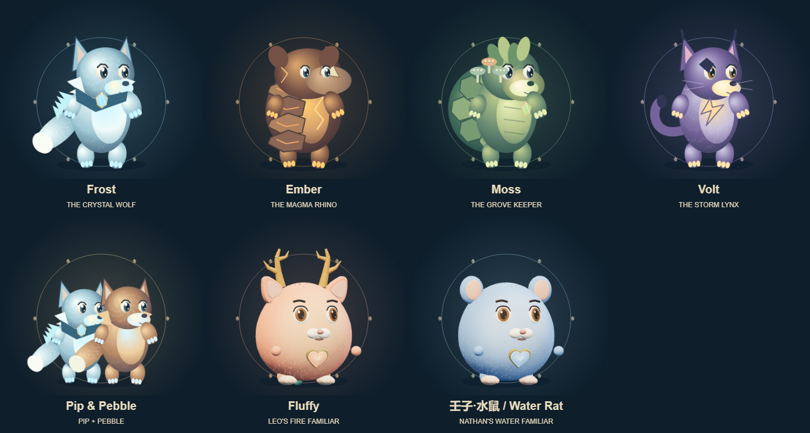

# Beast Kings · Legends / 兽王传奇

Nathan 与 Leo 的 2D 合作格斗作品。 / A 2D fighting game created with Nathan and Leo.

[单人试玩 / Solo play](https://sydneygemstone-sudo.github.io/student-works/beast-kings/builds/astra-legends/) · [双语测评 / Bilingual review](https://sydneygemstone-sudo.github.io/student-works/beast-kings/builds/astra-legends/review.html)



七种可选角色，包括使用原 AI Familiar 造型的 Fluffy 与壬子·水鼠。42 个角色招式定义带来不同的弹道、陷阱、位移、控制、护盾、回血、龙息和双兽合击。三个场景、练习与 AI 任务、宝石装备升级、进化、离线练习收益与三人联机。

Seven selectable guardians include the original AI Familiar shapes for Fluffy and Water Rat. Forty-two character move definitions provide distinct projectiles, traps, escapes, control, shields, healing, dragon breath and paired combos. Three arenas, practice and AI quests, earned equipment/upgrades, evolution, offline earnings and three-player multiplayer.

## 开始 / Start

GitHub Pages 提供单人模式。联机请在电脑运行服务，所有设备打开自己的 Tailscale HTTPS 地址。

GitHub Pages supports solo play. For multiplayer, run the server on a computer and open its Tailscale HTTPS address on every device.

```sh
cd builds/astra-legends
npm ci
npm start
```

Local default: http://localhost:8765. Configure your Tailscale Serve HTTPS route to that port. Keep the host running for multiplayer. Published addresses are placeholders; this archive does not expose the family's network. Saves stay in the same browser/origin. GitHub Pages and your private server have separate saves. After the HTTPS page finishes caching, solo play can reopen offline, including both Familiar atlases.

收益来自实际练习与任务，无挂机收益或真钱商店。游戏存档独立于 AI Familiar 账号；没有公开账户、聊天或钱包数据。

Earnings come from completed practice/quests, with no idle income or real-money shop. Game saves remain separate from AI Familiar accounts. No account records, conversations or wallets are published.

## 日志、验证与下一轮 / Logs, checks and next round

- [本次画面与招式 / Legends art and move log](LEGENDS.zh-en.md)
- [历次双语日志 / Bilingual changelog](CHANGELOG.zh-en.md)
- [预算参考 / Usage reference](COST-REPORT.zh-en.md)
- [使魔来源 / Familiar reference](FAMILIARS.zh-en.md)
- [测评模板 / Review template](PLAYTEST.zh-en.md)

33 engine/server/combat checks passed, including all 42 moves, plus three-profile browser synchronization, simulated multitouch, offline atlases/rewards and review-form checks. Physical iPad smoothness, real remote latency and child/teacher acceptance are still pending. Run `npm test` in the Legends build. This is a classroom iteration, with initial balance values awaiting a real round.

下次从大厅打开测评表：十项默认未测检查、一个问题、复现步骤和老师决定；草稿与历史保存在设备，可导出 Markdown/JSON。 / Start the next session with the lobby review: ten untested checks, one issue, reproduction steps and teacher decision. Drafts/history save on-device and export as Markdown/JSON.

Earlier published builds are retained for comparison. Dependencies, local sessions, secrets and private classroom records are excluded.
