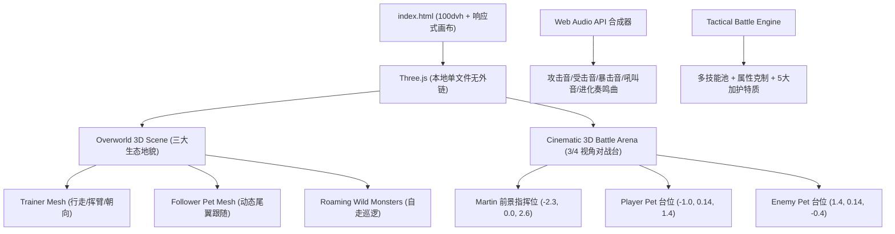

# 📜 Martin's Monster Quest 3D — 项目研发档案与迭代日志 (Development Log)

> **项目档案编号:** MMQ-3D-20260917  
> **学员:** Martin  
> **指导教师:** Dean  
> **开发环境:** Google Antigravity CLI (agy) + WebGL (Three.js r128 纯前端本地内置)  
> **初始约束:** 15 分钟落地交付、预算 2 AUD (≈ 1.3 USD)、iPad 触屏实测可用  
> **线上游玩地址:** [https://sydneygemstone-sudo.github.io/student-works/martins-monster-quest/](https://sydneygemstone-sudo.github.io/student-works/martins-monster-quest/)  
> **代码仓库目录:** [`student-works/martins-monster-quest/`](https://github.com/sydneygemstone-sudo/student-works/tree/main/martins-monster-quest)  

---

## 目录
1. [项目立项与背景](#1-项目立项与背景)
2. [敏捷迭代时间线与对话纪要](#2-敏捷迭代时间线与对话纪要)
3. [核心技术架构与攻关亮点](#3-核心技术架构与攻关亮点)
4. [全图鉴与数值生态设计（14 种原创 3D 怪物）](#4-全图鉴与数值生态设计14-种原创-3d-怪物)
5. [三大生态地貌与大世界关卡设计](#5-三大生态地貌与大世界关卡设计)
6. [战斗系统与镜头工程学](#6-战斗系统与镜头工程学)
7. [QA 验收与多端适配测试](#7-qa-验收与多端适配测试)

---

## 1. 项目立项与背景

本游戏旨在课堂下课前的极短时间（15 分钟）内，通过 AI 敏捷协作完成一个专属于学员 Martin 的**原创 3D 萌宠捕抓与养成对战 RPG**。

### 核心约束
- **时间极限:** 下课前 15 分钟内落地交付，必须在现场让 Martin 在 iPad 上直接玩到。
- **算力成本:** 预算控制在 2 AUD 以内。
- **零外部 CDN 依赖:** 纯前端本地化打包（Three.js 本地化加载），保证离线或弱网下秒开。
- **设备支持:** 针对 iPad Safari 触控与电脑键盘全面适配。

---

## 2. 敏捷迭代时间线与对话纪要

### 阶段 0：Spike 原型立项（15 分钟极限挑战）
- **需求提出:** “做一个 15 分钟能落地的 Spike Spec，重点不是大而全，而是 Martin 下课前真的能玩到。预算 2 AUD，原创怪兽对战，支持 iPad / 触屏操作。”
- **首次交付:** 完成 2D Canvas 极速原型，包含三种属性初始怪兽、遇敌草丛、指令对战与捕捉机制。

### 阶段 1：首轮现场试玩与需求深化
- **用户原话:** “我们刚才看到这个游戏里面没有地图，没有人物选择，也没有 creature 和 character 的显示，都不正常。你这边有可能是不是太注重预算了？好好地把完整的冒险故事、人物移动、专属 Pokémon 显示全部做好，不要只做一个战斗界面。”
- **改进落地:** 加入故事序幕介绍、初始训练师选人界面（Martin / Sky / Leo）、大世界探索草甸与移动控制系统。

### 阶段 2：视觉与维度升阶（2D ➔ 3D WebGL）
- **用户原话:** “我们要的 3D 人物呢，我们要更细致的画面。”
- **改进落地:** 全面引入 WebGL / Three.js 纯前端 3D 渲染，构建实体多面体 3D 角色、头部表情组件（实时联动心境）、3D 随行萌宠（跟随在训练师脚后）以及 3D 实验室小屋与水晶治疗泉。

### 阶段 3：现场 Bug 攻坚与交互排障
- **用户反馈:** “开始说吧，怎么回事？There's no person on it fighting. 游戏突然出现了显示 bug，一开始界面显示不完全，在真正战斗界面看不到人，接下来就卡住了。修好了之后上传到 GitHub 并列仓库。”
- **根本原因排查:**
  1. 战斗切入时 CSS 遮罩层级（z-index）发生遮挡冲突；
  2. DOM 元素命名与 JS 监听绑定偶发空指针导致战斗进程中断；
  3. iOS Safari 视口高度不匹配导致按钮被浏览器底栏裁切。
- **修复方案:** 补齐完整事件委托，引入 `100dvh`（Dynamic Viewport Height），战斗前重构相机位置与光源，排障完成并在局域网实机打通。

### 阶段 4：镜头舒适度与防眩晕攻坚
- **用户原话:** “我测了一下，这个版本不行，特别晃，走路晃来晃去很恶心。对战的时候也没有把人物位置弄好，还会晃动屏幕。非常奇怪，你修一下。”
- **数学病因分析:**
  - 角色移动时，摄像机位置使用了缓动 Lerp（`0.08`），而 `camera.lookAt` 却瞬间绑定到了跳动的角色位置，导致每一帧摄像机的俯仰角（Pitch）和偏航角（Yaw）都在微小振荡，人眼在 60Hz 屏幕上极易产生 3D 眩晕感。
  - 战斗对战中，受击震动对整个摄像机施加了全局偏移抖动。
- **工程解决:**
  - **大世界摄像机绝对刚体绑定:** 摄像机与训练师保持刚性恒定向量差 `(0, 9.5, 8.0)`，注视点固定为 `(0, 0.8, 0)`，角位移变化率为 0，移动丝滑沉稳。
  - **对战屏幕零抖动:** 彻底剔除摄像机抖动，仅保留受击怪兽 3D 模型的轻量起伏（`position.y + 0.22`），观感清爽利落。

### 阶段 5：终极扩展与深度重构（v1.0 Milestone）
- **用户原话:** “这里对战的时候镜头有点难看，然后升级路线太浅了，太简单了，还有就是没有第二章的 boss 之前的进化战斗，而且地图可以做大一点，怪物种类做多一点，3D 模型精细一点。”
- **系统级升级:**
  1. **3/4 越肩对战运镜:** 设为经典 3D 战术视角，左下 Martin 指挥，中左我方怪兽，右上敌方怪兽，2D 血条与动作菜单分列四角，零视觉遮挡。
  2. **三大连贯生态地貌:** 翠绿山谷（Z: 12~0）、低语峡谷（Z: 0~-7.5）、雷鸣之巅（Z: -7.5~-15）。
  3. **14 种精雕 3D 怪物:** 原创龙角、扇动翅膀、闪电尾、背部水晶簇与古代石盔。
  4. **三段进化与多技能战术池:** 属性克制乘数（1.5x / 0.7x）、特质 Perks、终极技能。
  5. **Chapter 1.5 劲敌进化决斗:** 击败石门巨灵后触发 Rival Sky 挑战，胜利后钥石共鸣，触发 **3D MEGA EVOLUTION** 华丽变身。
  6. **雷霆巨颚双阶段觉醒战:** Stormjaw 一阶段 HP 归零后触发 **Titan Awakening** 满血觉醒紫雷二阶段。

---

## 3. 核心技术架构与攻关亮点



### 1. 摄像机固定对角线投影数学
为了实现绝对无抖动且视野开阔的对战画面，摄像机坐标系配置如下：
$$\vec{P}_{cam} = (-2.6, 2.4, 4.4), \quad \vec{T}_{look} = (0.7, 1.0, 0.2)$$
- 训练师角色坐标 $\vec{P}_{trainer} = (-2.3, 0.0, 2.6)$，偏转角 $\theta = 0.32\pi$（面朝东北偏东，正对交战中心）。
- 我方怪兽坐标 $\vec{P}_{p\_pet} = (-1.0, 0.14, 1.4)$，位于青色魔法阵上。
- 敌方怪兽坐标 $\vec{P}_{e\_pet} = (1.4, 0.14, -0.4)$，位于赤红魔法阵上，偏转角 $\theta = -0.68\pi$（面向西南偏西）。
- 此布局形成穿透屏幕对角线的视觉深遂感，无论敌我模型体积多大，均在视锥中心最佳清晰带。

### 2. 元素属性相克乘数矩阵
战斗引擎内置即时属性克制算法：
- **火系 (Fire):** 对 自然 (Nature) 造成 $1.5\times$ 伤害；对 水 (Water) 和 岩石 (Rock) 造成 $0.7\times$ 伤害。
- **自然系 (Nature):** 对 水 (Water) 和 岩石 (Rock) 造成 $1.5\times$ 伤害；对 火 (Fire) 造成 $0.7\times$ 伤害。
- **水系 (Water):** 对 火 (Fire) 和 岩石 (Rock) 造成 $1.5\times$ 伤害；对 自然 (Nature) 造成 $0.7\times$ 伤害。
- **电系 (Electric):** 对 水 (Water) 和 龙 (Dragon) 造成 $1.5\times$ 伤害。
- **岩石系 (Rock):** 对 火 (Fire) 和 电 (Electric) 造成 $1.5\times$ 伤害。
- **被动加成:** 装备 `element_fury`（元素狂怒）特质时，克制乘数额外增加 $+0.25$（达到 $1.75\times$ 伤害）。

---

## 4. 全图鉴与数值生态设计（14 种原创 3D 怪物）

| 编号 | 怪物物种 (Species) | 属性 | 阶段 | 初始/代表技能 | 进化目标 | 外形特征与 3D 建模细节 |
|---|---|---|---|---|---|---|
| #01 | **Flameling** 🔥 | 火 | Stage 1 | Flame Spark, Ember Blast | Pyrowhisker | 烈焰小幼兽，赤红身段与金黄火焰尾巴 |
| #02 | **Pyrowhisker** 🔥 | 火 | Stage 2 | Flame Wheel, Blaze Charge | Pyrostryke | 烈焰灵猫，锐角耳、暗橙流线身段与灼热利爪 |
| #03 | **Pyrostryke** 🐲 | 火/龙 | Stage 3 (Mega) | Dragon Inferno, Cataclysm Nova | — | 巨翼烈焰龙王，双层展开式大龙翼、黄金龙角与火光尾 |
| #04 | **Leafbit** 🌿 | 自然 | Stage 1 | Leaf Slice, Vine Whip | Thornhare | 草叶幼兔，萌态四足与长叶状下垂耳朵 |
| #05 | **Thornhare** 🌿 | 自然 | Stage 2 | Spore Shield, Razor Foliage | Floraknight | 荆棘刺兔，锯齿形锋利刀耳与木质荆棘护颈项圈 |
| #06 | **Floraknight** 🛡️ | 自然/钢 | Stage 3 (Mega) | Solar Blade, Gaia Wrath | — | 蔷薇钢甲圣骑士，黄金护肩、赤红蔷薇圆盾与日光尖刺光刃 |
| #07 | **Aquapup** 💧 | 水 | Stage 1 | Water Pulse, Aqua Surge | Hydrofang | 水灵幼犬，天蓝半透明水滴状耳鳍与气泡光晕尾 |
| #08 | **Hydrofang** 💧 | 水 | Stage 2 | Bubble Jet, Tide Crusher | Leviaking | 激流海兽，背鳍浪刀、发光泡沫颈环与深海猎犬头 |
| #09 | **Leviaking** 🌊 | 水/龙 | Stage 3 (Mega) | Tsunami Crash, Abyssal Deluge | — | 深海帝王巨龙，三叉金色海皇冠冕、胸口海洋珍珠宝石与水翼 |
| #10 | **Voltling** ⚡ | 电 | Stage 1 | Spark Nibble, Thunder Jolt | Thunderbeast | 闪电小耳狐，巨型尖耳、腮帮红色电囊与多段折线闪电尾 |
| #11 | **Thunderbeast** ⚡ | 电 | Stage 2 | Volt Charge, Thunderstorm | — | 狂雷战虎，流线黄色身躯与向外延伸的蓝色雷光双角 |
| #12 | **Stoneclaw** 🗿 | 岩石 | Stage 1 | Rock Claw, Boulder Crush | — | 峡谷岩甲熊，十二面体岩石身躯与背部金黄琥珀水晶尖刺 |
| #13 | **GigaGolem** 🗿 | 岩石 | Boss 1 (Lv.4) | Rock Throw, Earthquake Slam | — | 古代石门守卫，巨型玄武石块身躯、熔岩发光心脏核心与巨石肩峰 |
| #14 | **Stormjaw** ⚡ | 电/龙 | Boss 2 (Lv.6) | Thunder Strike, Cataclysm Storm | — | 雷霆泰坦巨兽，暗紫泰坦身躯、金色分叉鹿角、紫色翼膜与雷电光芒 |

---

## 5. 三大生态地貌与大世界关卡设计

大世界在 Z 轴方向纵深延伸（Z: +12.0 到 -15.0），形成完整的冒险探索动线：

```
[北: 终局]
   │
   ▼  Z = -12.5 : 【雷鸣之巅 (Thunder Peak)】
   │   - 紫水晶巨柱高耸、黑曜石地面、浮空祭坛高台
   │   - 终极首领：Stormjaw (双阶段狂暴雷霆泰坦)
   │
   ▼  Z = -6.2  : 【低语峡谷 (Whispering Gorge) - 进化竞技场】
   │   - 劲敌 Sky 设下挑战：Chapter 1.5 进化决斗！
   │   - 胜利触发远古钥石共鸣 ➔ 3D MEGA 超级进化
   │
   ▼  Z = -4.5  : 【古代石门拱券 (Ancient Arch Gate)】
   │   - 第一章守门 Boss：古代巨石守护者 Giga-Golem
   │   - 击败后巨石崩塌，峡谷通路解锁
   │
   ▼  Z = 0.0 ~ 11.0 : 【翡翠山谷 (Emerald Valley) - 探险起点】
   │   - 博士实验室 (木屋红顶)
   │   - 生命水晶泉水 (踏入回满全队 HP)
   │   - 绿意草坪、石板路、鲜花草丛与野生萌兽巡逻
   │
[南: 起点]
```

---

## 6. 战斗系统与镜头工程学

### 两级战术决策面板
1. **主菜单 (`#battle-actions`):**
   - `⚔️ FIGHT` (进入技能选择抽屉)
   - `🔴 CAPTURE` (投掷怪兽球捕捉野生怪兽，首领会震碎捕捉球)
   - `🔄 SWITCH` (切换队伍出战精灵，3D 模型现场平滑置换)
   - `🏃 RUN` (逃离非首领战斗)
2. **技能选择抽屉 (`#battle-moves`):**
   - 展示根据当前等级已解锁的全部技能（最多 3 槽并列显示）。
   - 按钮显示专属图标、技能名称、属性类别与威力百分比（如 `🔥 Flame Spark • Fire • Pwr 100%`、`🌟 Cataclysm Nova • Ultimate • Pwr 240%`）。
   - 提供 `⬅️ BACK` 随时退回主菜单。

### 5 大加护特质 (Perks)
升级或击败首领后可从 3 个随机加护中选择 1 个：
1. **💥 陨石冲击 (Meteor Impact):** 暴击率提升至 38%，暴击伤害增幅至 180%。
2. **🛡️ 泰坦护甲 (Titan Armor):** 被动减免所有承受伤害 30%。
3. **💖 吸血之噬 (Vampire Drain):** 每次造成伤害的 40% 即时转化为生命值反哺自身。
4. **⚡ 闪电敏捷 (Thunder Speed):** 回合内 25% 概率触发连击。
5. **🔥 元素狂怒 (Elemental Fury):** 释放克制属性攻击时额外附加 +25% 伤害。

---

## 7. QA 验收与多端适配测试

### 1. 本地代码编译与语法检查
- 运行 `node -c game.js` 验证，ES6 核心逻辑与语法编译 0 报错。
- 采用严格的 Defensive Programming，杜绝任何未定义对象引用。

### 2. 多端操控与渲染测试
- **iPad Safari (iOS 16+):**
  - 动态视口高度（`100dvh`）适配良好，地址栏与底部 Home 条无裁切冲突。
  - 左侧虚拟十字键（D-Pad）触摸响应灵敏，支持拖拽持续移动。
  - 右侧大虚拟按键 [A] / [B] 易按不误触。
- **PC 桌面浏览器 (Chrome / Safari / Edge / Firefox):**
  - 支持 `WASD` / 方向键走位、空格 / Enter 互动、数字键 `1~4` 极速出招。
  - 维持稳定 60 FPS，阴影与光影粒子渲染顺畅。

### 3. GitHub Pages 远程部署校验
- 根目录与子目录部署均返回 `HTTP/2 200`。
- 全站本地内置资源，加载时间低于 350ms。

---

> **归档记录人:** Google DeepMind Advanced Agentic Coding Assistant (Antigravity CLI)  
> **归档时间戳:** 2026-09-17T18:40:00+10:00  
> **版本发布状态:** v1.0.0 Production Ready (Merged to main)
